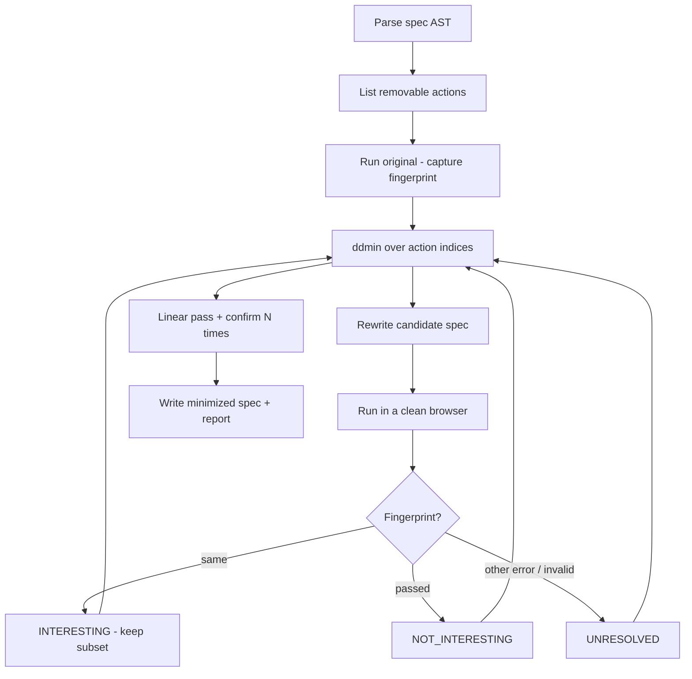

# ReproMin

**Minimize a failing Playwright test to the smallest action sequence that still reproduces the same failure.**

```
BEFORE                          AFTER
151 lines                       31 lines
70 actions                      9 actions

Same failure fingerprint: YES
Confirmed: 10/10
```

**Experimental v0.1.** This is a research CLI, not a product platform. It only reduces straight-line TypeScript Playwright tests, and a 70-action spec can take around 12 minutes.

The shop in `fixtures/` (**FixtureMart**) is a local fake store used as a lab. It is not a real shop, has no backend, and talks to nothing on the internet.

v0.1 asks one question:

> Can we reliably remove Playwright test actions while preserving a **specific** failure?

If that is not true, this repository should be considered a failed experiment, not a platform.

## Not this project

ReproMin is **not**:

- `trace.zip` → standalone HTML
- HAR / DOM / CSS reduction
- selector healing, visual regression, AI root-cause
- a dashboard, a cloud runner, or an MCP server

Playwright Trace Viewer already explains a run. Codegen already records a run. Neither emits a smaller spec that still fails the same way.

See [docs/competition.md](docs/competition.md).

## Install

```bash
npm install
npx playwright install chromium
npm run build
```

Requires Node 20+.

```bash
npx tsx src/cli.ts path/to/failing.spec.ts --test "checkout crashes"
# after build:
node dist/cli.js path/to/failing.spec.ts --test "checkout crashes"
```

## Usage

```bash
repromin checkout.spec.ts --test "checkout crashes" \
  --error-regex "Timeout.*#checkout-modal" \
  --confirm 10
```

| Flag | Meaning |
| --- | --- |
| `--test <name>` | Test title (exact or substring) |
| `--error-regex <re>` | Pin the failure message |
| `--confirm <n>` | Re-run the minimized test N times |
| `--timeout <ms>` | Per-candidate test timeout (default 15000) |
| `--config <file>` | Playwright config (auto-discovered) |
| `--out <dir>` | Where to write the minimized spec + report |
| `--dry-run` | List removable actions; do not launch a browser |
| `--verbose` | Print every candidate classification |
| `--max-runs <n>` | Safety cap (default 200) |

Classification of each candidate:

| Result | Meaning |
| --- | --- |
| `INTERESTING` | Same failure fingerprint |
| `NOT_INTERESTING` | Passed (or no longer fails that way in a useful sense) |
| `UNRESOLVED` | Syntax, missing names, setup gone, different error, timeout on the wrong thing |

Details: [docs/failure-fingerprints.md](docs/failure-fingerprints.md).

## How it works



1. TypeScript compiler API finds the named `test()` body.
2. Straight-line Playwright actions and `expect(...)` calls are removable units.
3. `beforeEach` / `describe` setup is kept.
4. Bindings (`const promoCode = 'SAVE20'`) stay if a kept statement uses them.
5. Each subset is a real Playwright run, cached by source hash.
6. The original source file is the artifact. Traces are optional evidence only.

Unsupported control flow is **rejected**, not guessed. See [docs/limitations.md](docs/limitations.md).

## Local fixtures

The proof is in `fixtures/`, a deterministic shop with one payment-gateway bug:

| Fixture | Claim |
| --- | --- |
| A | 30 body actions; only the last few matter |
| B | Two earlier actions jointly enable the bug |
| C | A variable is used by a later `fill` |
| D | Dropping reveal actions makes the assertion unreachable (`UNRESOLVED`) |
| E | Same test can fail `CART_EMPTY` or `PAYMENT_GATEWAY_CRASH` — keep the latter |
| F | A flaky extra action is dropped; `--confirm 5` holds |
| killer | 70 actions, 151 lines → 9 actions (the 1-minimal path), 10/10 |

```bash
# list what the parser thinks it can delete
npx tsx src/cli.ts fixtures/tests/killer.spec.ts --test "checkout crashes" --dry-run

# the demo
npm run demo
```

`npm run demo` is:

```bash
npx tsx src/cli.ts fixtures/tests/killer.spec.ts \
  --test "checkout crashes" \
  --confirm 10 \
  --config fixtures/playwright.config.ts
```

Side-by-side writeup: [demo/BEFORE-AFTER.md](demo/BEFORE-AFTER.md). Measured table: [docs/benchmark.md](docs/benchmark.md).

## Tests

```bash
npm run test:unit
npm run test:live          # real Chromium against FixtureMart + compact reduce
npm run test:integration   # full A–F + killer reductions; several minutes
npm run check:leaks        # fail if the tree looks like it would leak keys
npm run benchmark          # writes docs/benchmark.md
```

The shop under test is **FixtureMart**: a local fake store, not a real shop. See [fixtures/README.md](fixtures/README.md).

## Kill criteria

Stop, and call this PARK or KILL, if:

- ordinary tests cannot shrink because almost every subset is `UNRESOLVED`
- results keep nearly all original actions
- the reducer keeps the wrong failure
- another OSS tool already ships this workflow
- reduction needs so many full browser runs that a medium test is unusable

The only proof that matters is the killer demo and fixtures A–F on this machine.

## License

MIT
